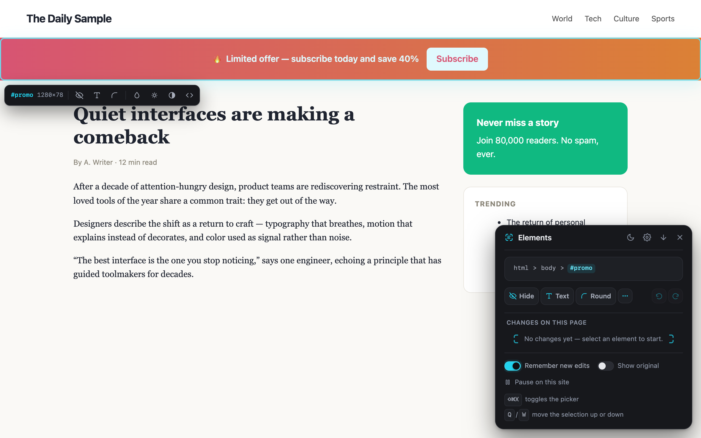
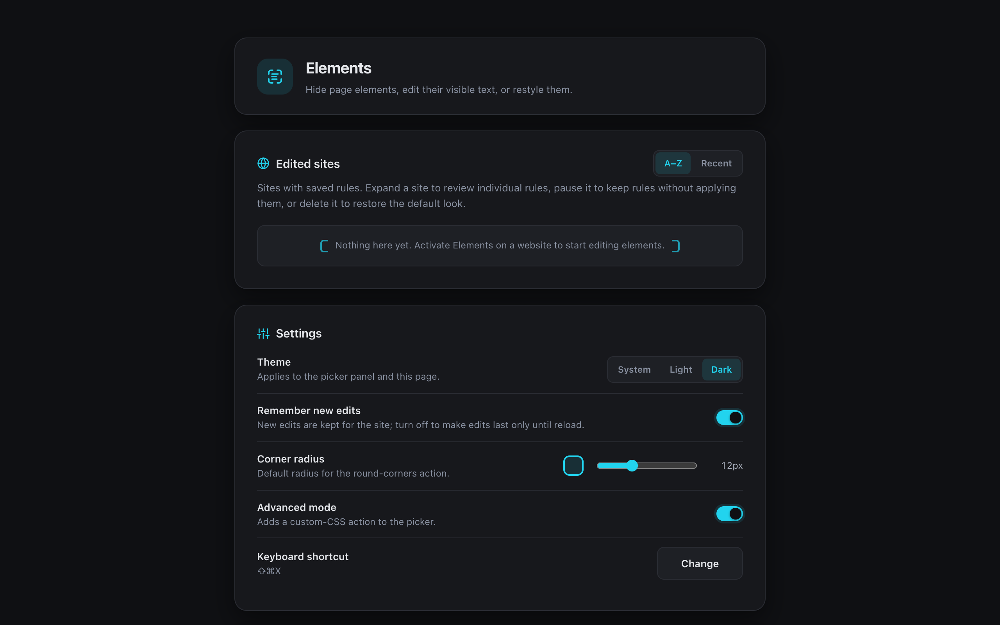
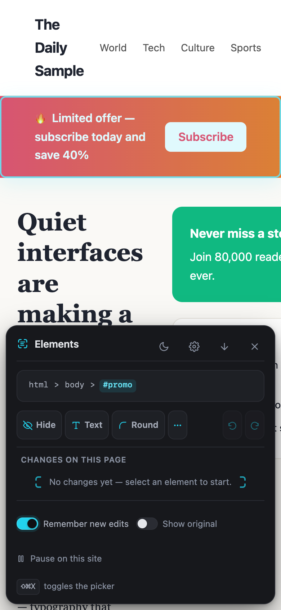
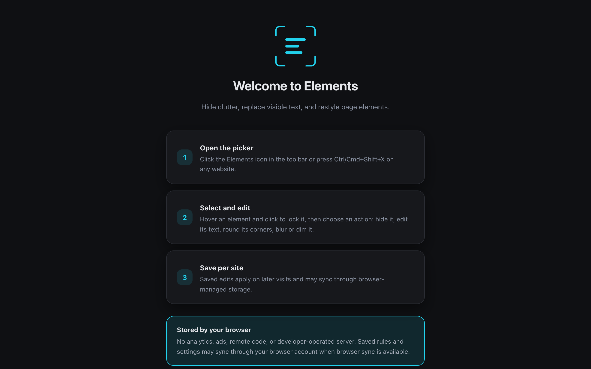

<p align="center">
  
</p>

# Elements

<p align="center">
  Hide distractions, edit visible text, and restyle page elements.<br>
  Your rules stay in browser-managed storage and apply again on your next visit.
</p>

<p align="center">
  <a href="https://github.com/QenTerra/elements/actions/workflows/ci.yml"></a>
  <a href="https://github.com/QenTerra/elements/releases/latest"></a>
  <a href="LICENSE"></a>
  
</p>

<p align="center">
  <a href="#status">Status</a> ·
  <a href="#interface">Interface</a> ·
  <a href="#features">Features</a> ·
  <a href="#install">Install</a> ·
  <a href="#documentation">Documentation</a>
</p>

## Status

Elements 1.0.0 is the current public release for Chrome and compatible
Chromium browsers. GitHub distributes an unsigned archive for installation in
Developer mode; Chrome Web Store distribution is not currently available.

The extension is local-first: it has no analytics, advertising, remote code,
or developer-operated backend. Current limitations are listed below instead of
being politely hidden in marketing fog.

## Requirements

- Chrome or a compatible Chromium browser for normal use.
- Developer mode when installing the unsigned GitHub release archive.
- Node.js 22, npm, Python 3.11 or later, and a supported Chromium build when
  verifying the source repository.

## Interface





<table>
  <tr>
    <td width="38%" valign="top">
      
    </td>
    <td width="62%" valign="top">
      
    </td>
  </tr>
</table>

## Features

<table>
  <tr>
    <td width="33%" valign="top">
      <strong>Pick precisely</strong><br>
      Hover to preview, click to lock, then choose an action. Use <code>Q</code> and <code>W</code> to move through parent and child layers without losing the active breadcrumb.
    </td>
    <td width="33%" valign="top">
      <strong>Change what you see</strong><br>
      Hide blocks, replace visible text, round corners, blur, dim, desaturate, or add sanitized custom CSS. Undo and redo cover every rule change.
    </td>
    <td width="33%" valign="top">
      <strong>Keep it local</strong><br>
      Save rules per site, pause them without deleting them, and export a JSON backup. Private-window changes remain temporary.
    </td>
  </tr>
</table>

The picker opens from the toolbar or with `Ctrl/Cmd+Shift+X`. Its layout adapts
from a desktop corner panel to a touch-sized bottom sheet, with light, dark, and
system themes throughout the extension.

## Install

### Download

The [latest release](https://github.com/QenTerra/elements/releases/latest)
contains the unsigned Chrome and Chromium build.

| Browser             | Archive                                                                                                                | Intended use                             |
| ------------------- | ---------------------------------------------------------------------------------------------------------------------- | ---------------------------------------- |
| Chrome and Chromium | [`elements-1.0.0-chrome.zip`](https://github.com/QenTerra/elements/releases/latest/download/elements-1.0.0-chrome.zip) | Unpack and load from the extensions page |

Chrome Web Store distribution still requires its signing and review process.

### Install

1. Download and unpack the Chrome archive.
2. Open `chrome://extensions`.
3. Enable **Developer mode**.
4. Select **Load unpacked**, then choose the extracted folder.

## Privacy and security

| Permission  | Purpose                                                      |
| ----------- | ------------------------------------------------------------ |
| `storage`   | Save rules and settings in browser-managed extension storage |
| `scripting` | Start Elements in a compatible tab that was already open     |
| `*://*/*`   | Reapply user-created rules on HTTP and HTTPS sites           |

Elements has no analytics, advertising, remote code, or developer-operated
backend. It does not send saved rules or page contents to the developer.
Browser sync may process saved data when available; Elements falls back to
local storage when data is too large or sync is unavailable. See the
[Privacy Policy](PRIVACY.md) for the complete data-handling description.

## Development

Run the complete repository gate from the canonical checkout:

```sh
node scripts/verify-repository.mjs
```

The verifier copies the source into a unique operating-system temporary
directory, installs dependencies there, and runs formatting, lint, type,
documentation, unit, security, build, Chromium end-to-end, Pages, and release
artifact checks. Dependency trees, browser binaries, WXT output, reports, and
release staging never enter the repository.

To inspect or run the verified external workspace, preserve it explicitly:

```sh
ELEMENTS_KEEP_VERIFY_WORKSPACE=1 node scripts/verify-repository.mjs
```

The command prints the external workspace path. Run `npm run dev` there for an
interactive WXT session, or load its `.output/chrome-mv3` directory in Chrome.
Make source changes in the canonical checkout and rerun the verifier. See the
[development guide](docs/DEVELOPMENT.md) for the full boundary.

## Architecture

Elements uses WXT, TypeScript, React, and the Manifest V3 extension model.

```text
entrypoints/
  background.ts          persistent-write owner and browser integration
  content.ts             lightweight content-script entrypoint
  elements-ui.tsx        lazy picker application
  options/               settings and saved-rule management
  onboarding/            first-run guide
src/
  core/                  storage, data contracts, themes, protocol
  content/               selector engine, rule engine, controller, overlay
  components/            shared UI components
  qds/                   shared design tokens and component foundations
```

The background service worker validates a versioned message protocol and owns
persistent writes. The page controller compiles visual rules into an isolated
stylesheet; reversible text wrappers retain original DOM nodes and listeners.
React is loaded into the picker only after activation.

## Releasing

```sh
node scripts/verify-repository.mjs
```

A `v*` tag runs the full release workflow, including Chromium E2E tests, and
publishes the Chrome archive with notes taken from [CHANGELOG.md](CHANGELOG.md).
Tagging and publishing remain separate maintainer-authorised actions; a green
local check does not create or replace a release.

## Current limitations

- The published build targets Chrome and compatible Chromium browsers only.
- Chrome Web Store distribution still requires its signing and review process.
- Installation from GitHub uses an unsigned archive and Chrome's developer mode.

## Documentation

- [Product and user Wiki](https://github.com/QenTerra/elements/wiki)
- [Documentation index](docs/README.md)
- [Building from source](docs/BUILDING.md)
- [Architecture](docs/ARCHITECTURE.md)
- [Dependencies](docs/DEPENDENCIES.md)
- [Troubleshooting](docs/TROUBLESHOOTING.md)
- [Contributing guide](CONTRIBUTING.md)
- [Changelog](CHANGELOG.md)
- [Privacy Policy](PRIVACY.md)
- [Terms of Use](TERMS_OF_USE.md)
- [Security Policy](SECURITY.md)
- [Third-party notices](THIRD_PARTY_NOTICES.md)
- [MIT License](LICENSE)

## Contact

- Product support, product help, and technical questions: [support@qenterra.com](mailto:support@qenterra.com).
- Proposals, general enquiries, and commercial matters: [contact@qenterra.com](mailto:contact@qenterra.com).
- Vulnerabilities: follow the private reporting process in [SECURITY.md](SECURITY.md).

## License

Elements source code is available under the [MIT License](LICENSE). Runtime,
build, and website dependencies remain subject to their own licenses; see
[Third-party notices](THIRD_PARTY_NOTICES.md).
