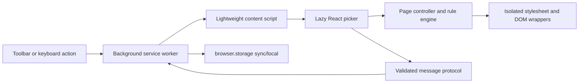

# Architecture

Elements is a Manifest V3 extension built with WXT, TypeScript, React, and
browser extension APIs. The content script remains small; the React picker is
loaded only after the user activates Elements.

## Runtime flow

## Entrypoints

- `entrypoints/background.ts` owns browser integration and persistent writes.
- `entrypoints/content.ts` is the lightweight page entrypoint.
- `entrypoints/elements-ui.tsx` loads the picker application on demand.
- `entrypoints/options/` manages settings, saved rules, import, and export.
- `entrypoints/onboarding/` presents the first-run guide.

## Rule application

The page controller compiles visual rules into an extension-owned stylesheet.
Text changes use reversible wrappers that retain original DOM nodes and event
listeners. Undo and redo operate on the extension's rule history rather than
reloading the page.

Custom CSS is parsed and sanitized before it is stored or applied. Extension
surfaces and styles are removed deterministically when Elements closes or a
rule is reverted.

## Persistence

The background service worker is the persistent-write owner. Messages use a
versioned, runtime-validated protocol. Rules and settings prefer
`browser.storage.sync` and fall back to `browser.storage.local` when sync limits
or availability require it.

Imports are validated before application and keep a local rollback snapshot.
Private-window changes remain temporary and are not written by Elements.

## Security boundaries

- Manifest V3 disallows remotely hosted executable extension code.
- Host access is used to apply user-created rules on compatible HTTP and HTTPS
  pages, not to transmit page contents to the developer.
- Persistent writes pass through the validated background protocol.
- Custom CSS is sanitized before storage and application.
- The extension has no developer-operated backend, analytics, or advertising.

See [Privacy](../PRIVACY.md), [Security](../SECURITY.md), and
[Dependencies](DEPENDENCIES.md).
